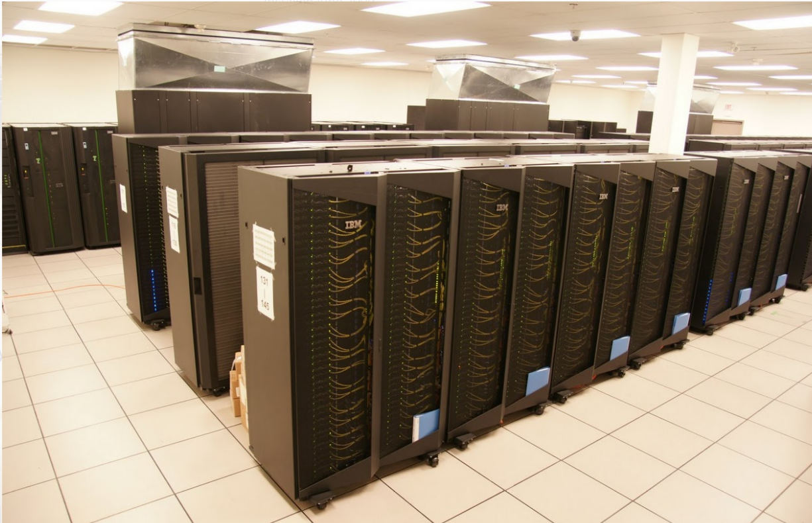
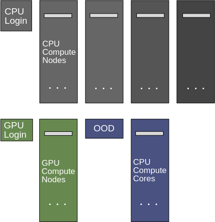
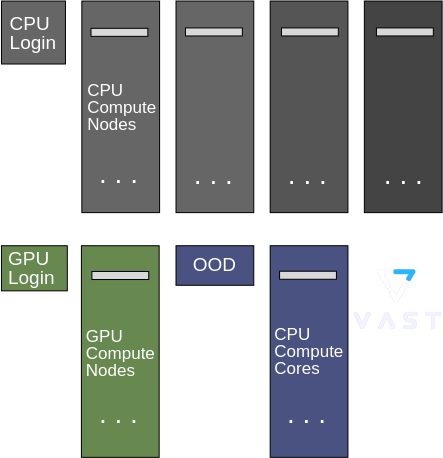
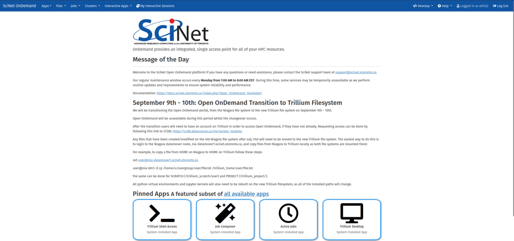

## In this workshop...

 * Why Python?
 
 * Why Supercomputers?

 * Access
 
 * Using Trillium
 
 * Installing packages

 * More about OnDemand

# Why Python?

## Python is great

  - Python is a high-level, interpreted language.
    . . .
  - Python is fairly easy to learn, very expressive, and, not
    surprisingly, very popular.
    . . .
  - Its greatness is in large part due to the available packages.
    . . .
  - And in its interactive computing paradigm (=> Jupyter Lab)
    . . .
  - Development in Python can be substantially easier (and
    thus faster) than when using compiled languages.
    . . .
  - But the interpreted and dynamic nature of Python is often at odds with "high performance".   
    **Yes, Python itself is slow!**
    . . .
  - This matters a lot less when Python is the 'driver' or 'glue language' for optimized packages or programs, such as for AI and ML.

## Running example

[[


|||

. . .

  * We have a data set of images of fashion items,    
    \footnotesize ("T-shirt/top", "Trouser", "Pullover", "Dress", "Coat", "Sandal","Shirt", "Sneaker", "Bag", "Ankle boot"):    
    See: ****<https://github.com/zalandoresearch/fashion-mnist>****
    \normalsize    
    . . .
  * We want to train an artificial neural work on this data set so we could recognize items in other images.
    . . .
  * We'll use PyTorch for this task.

. . .
This use case was taken from a PyTorch tutorial:    
\footnotesize
****<https://docs.pytorch.org/tutorials/beginner/basics/quickstart_tutorial.html>****
. . .

\normalsize
Although this example would be too small to warrant running on the Trillium supercomputer, it will demonstrate many aspects of running Python applications on such a system.

]]


# Why use a supercomputer?

## Why use a supercomputer?

Your research project may need more resources than your laptop can provide.

. . .

This may be for several reasons:

. . .

 1. Your research computations are too large to fit on your laptop.
    . . .
 2. The computations are too slow.
    . . .
 3. The computations are too plentiful.

. . .

[[

So you go to one of the Alliance's 'advanced research computing' clusters: like Nibi, Fir, Narval, Rorqual and Trillium.

||


]]

. . .

Congratulations, you are now doing ****Advanced Research Computing****!


# Advanced Research Computing

## A supercomputer is just like your laptop

. . .

Haha! You didn't really think so, right?\vspace{-1mm}

[[
.
.
\setrelfigwidth{0.8}
-><-
.
.
@ @ @ 3
We are going to need to make some adjustments.
@ @ @ @
||||

]]

. . . 

## Using a supercomputer is different

. . .
 1. It is remote.
    . . .
 2. It's usually command-line driven.
    . . .
 3. It is a shared resource.
    . . .
 4. It is not your own machine.


## But it's still got Python, right?

Well yes, but:
. . .
###
Many tutorials on Python, AI and ML assume that you are working on your own machine and have full privileges to reconfigure it (and mess it up).
.
. . .
###
We'll show you how to operate in this shared space, focusing in particular on Trillium    
(but touching upon the other national systems as well).
.
. . .
### When do we get to running Jupyter notebooks?

. . .

Patience, we'll get there.
.

# Getting started

## Let's get onto Trillium!

What do you need to follow along this afternoon:

  - An Alliance CCDB Account:    
    ****<https://ccdb.alliancecan.ca>****
    . . .
  - Setup MFA on CCDB    
    ****<https://ccdb.alliancecan.ca/multi_factor_authentications>****
    . . .
  - Access to Trillium (Resource -> Access Systems)    
    ****<https://ccdb.alliancecan.ca/me/access_systems>****
    . . .
  - Optional for today:
     - An ssh client;
     - Setup SSH keys.
       ****<https://docs.alliancecan.ca/wiki/SSH_Keys>****

. . .
This will give you access to both Trillium terminal and SciNet's OnDemand service.
. . .
You can learn a lot more about using Trillium than we will cover today, in the self-guided course    
"Intro to Trillium", see ****<https://scinet.courses/1389>****.

## Logging in

[[

### Option 1: Through an ssh client

Connects directly to the Trillium command line.

. . .

The supercomputer runs the remote **ssh server**.  You local computer run the **ssh client**.

. . .

  * Open a (local) terminal
    . . .
  * Type (uses SSH keys):    
    \small
```bash
   ssh USERNAME@trillium.alliancecan.ca
```
. . .
  * Use your Yubikey or Duo app as 2nd factor.
    . . .
  * You now get a command line prompt on a Trillium login node.

.

||

. . .

### Option 2: Through Open OnDemand

This is SciNet's **web interface** to Trillium meant for interactive applications.
. . .
OnDemand can also be used to get to the Trillium command line in ****your browser.****

  * Go to ****https://ondemand.scinet.utoronto.ca****
    . . .
  * Log in with your CCDB USERNAME and password.
    (note: don't use your email).
    . . .
  * Use your Yubikey or Duo app as 2nd factor.
    . . .
  * You can now go to "Clusters; Trillium Shell Access" to get a command line on one of the Trillium login nodes.

]]

# Hands-on 1

## Hands-on 1 (5 min)

Get logged into Trillium by one of these two methods.

Then, type the command

```bash
 $ which python
```

(and press Enter).

It should say:

```pascal
/cvmfs/soft.computecanada.ca/gentoo/2023/x86-64-v3/usr/bin/python
```
.
. . .

*Note: The dollar sign ("`$`") in the slides will be an abbreviation of the full prompt, which will look more like* `[rzon@tri-login01 ~]$`.

## Different organizations

A digression about all those different organizations

[[

### Digital Research Alliance of Canada


||

### CCDB

]]

[[

### Compute Canada

||

### SciNet

]]

## Command line

So we're always using this ~~~black screen of death~~~ command line?

. . .

Pretty much, yes, because

. . .

  * In HPC and supercomputing, that's what people use.
    . . .
  * Any repetitive or large scale computational work requires working with the command line. 
    . . .
  * Graphical User Interfaces (GUIs) would only offer existing functionality and GUI workflows are harder to automate or documents.
    . . .
  * Being familiar with the command line makes you more efficient, consistent, and productive in managing your data and your workflows.

. . .
Need to brush up on the Linux command line? SHARCNET has a self-guided course for that: ****<https://training.sharcnet.ca/courses/enrol/index.php?id=182>****.


## Understanding the Trillium system

[[
\vspace{-3mm}


||
\small\vspace{-1mm}
. . .
### Login nodes
\vspace{-1mm}

  * Ssh reaches the CPU or GPU login nodes.
  * OnDemand reaches the OOD server.
  * Shared among users
  * Meant for preparing your work and software.
. . .

### Compute nodes
\vspace{-1mm}

  * CPU: scheduled by 192-core node.
  * GPU: scheduled by full NVIDIA H100 GPU.
  * No internet access.
  * Read-only home directory.
. . .

### OOD compute cores
\vspace{-1mm}

  * Scheduled by core and memory
  * Internet access.
  * Writable home directory
]]

## Understanding the Trillium system

[[
\vspace{-3mm}


||
\small\vspace{-1mm}

### Login nodes
\vspace{-1mm}

  * Ssh reaches the CPU or GPU login nodes.
  * OnDemand reaches the OOD server.
  * Shared among users
  * Meant for preparing your work and software.

### Compute nodes
\vspace{-1mm}

  * CPU: scheduled by 192-core node.
  * GPU: scheduled by full NVIDIA H100 GPU.
  * No internet access.
  * Read-only home directory.

### OOD compute cores
\vspace{-1mm}

  * Scheduled by core and memory
  * Internet access.
  * Writable home directory
]]

# Hands-on 2

## Hands-on 2 (5 minutes)

* From a CPU login node, copy the python code in /home/rzon/fashion.py to your own directoyr.

* Try to run it with `python fashion.py`; it should fail.

* Try `pip install torch`. What does it do? Does it work after that?

Why not?

# Software packages

## It's a shared system

It is impossible to simultaneously install every user's required software and software version.  

. . .

### Almost all installed software is made available using modules
. . .
  * These set environment variables (`PATH`, etc.)
     . . .
  * Allows multiple, conflicting versions of a given package to be available.
    . . .
  * ****`module overview [MODULE]`**** shows the available software.
. . .

### Python wheels

  * The module system does not work well for Python packages.
    . . .
  * One might try to just install these using `pip`, but you would get generic, non-optimized versions.
    . . .
  * To support optimized version of python packages, without requiring users to compile these themselves, we have a ****wheelhouse**** of packages that you can install into ****virtual environments****.
    . . .
  * ****`avail_wheels [PACKAGE]`**** shows the available python packages.

## Virtual environments

If you "pip installed"-ed `torch` in Hands-on 2, it did something:
. . .
  * A little utility called `mii` would have found a number of versions of `pip`.\vspace{-2mm}
    . . .
  * If you selected one, pip would install it for that version.was tied to a specific python module.\vspace{-2mm}
    . . .
  * Pip installed the package in `$HOME/.local/lib/pythonVERSION/site-packages`.

But since we did not load that python module, so `python fashion.py` failed.

### Bad solution: only load a module

If you do `module load python/VERSION`, it would work now.

But what if you yourself need to use different sets of packages?

### Good solution: Use a virtual environment
\vspace{-2mm}
```bash
$ module load python/3.13
$ virtualenv --no-download ~/.virtualenvs/myenv
$ source $HOME/.virtualenvs/myenv/bin/activate
(myenv) $ pip install --no-index torch
```

# Hands-on 3

## Hands-on 3 (10 minutes)

 * Create the virtual environment. You will also need the package `torchvision`, so:
```bash
    $ module load python/3.13
    $ virtualenv --no-download ~/.virtualenvs/myenv
    $ source $HOME/.virtualenvs/myenv/bin/activate
    (myenv) $ pip install --no-index torch torchvision
```

  * By the way, the options `--no-downloads` and `--noindex` cause this procedure to only use optimized packages from the wheelhouse.*

  * What pip installed in the default directory, would override the ones in the virtual environment, so remove that:
```bash
    $ rm -rf $HOME/.local/lib/python*/site-packages
```
 * Make sure `python fashion.py` now starts properly.
   . . .
 * And see what fails next.\pause
   (really? sorry yeah, really.)

## To the compute nodes!

```bash
(myenv) $ python fashion.py
CPU time limit exceeded
```

 * We ran this on a CPU login node, a **shared resource**.

 * For fairness, each user can only run a limit amount of time.
   . . .
 * For longer runs, you need to submit a job to run on the compute nodes.
   . . .
   
****Caveat (again)! This task here is not really heavy enough to warrent using a full 192-core Trillium node!****

## Peculiarities of Trillium compute nodes 

[[

.

 1. You always get a multiple of 192-core nodes
    (or a multiple of GPUs)
    . . .
 2. They run batch jobs through a scheduler
    . . .
 3. They run detached from a terminal
    . . .
 4. Cannot write to $HOME
    . . .
 5. No internet access
    . . .
  
|||

So:

 1. Bundle up short and small jobs (beyond today's workshop).    
    .
    .
    . . .
 2. Write a job script to be submitted to the scheduler.
    .
    . . .
 3. Fine, but we can get emails when the job starts and ends.
    .
    . . .
 4. Copy everything for a job to $SCRATCH
    . . .
 5. Write a separate python script to download the data (or run once from the login node).  


]]


# Hands-on 4

## Hands-on 4 (20 min)

  * Setup a directory in scratch:\vspace{-1mm}

```bash
    (myenv) $ mkdir $SCRATCH/myrun
    (myenv) $ cp fashion.py $SCRATCH/myrun
    (myenv) $ cd $SCRATCH/myrun
```
. . .
\vspace{-3mm}

  * Download the data from the login node:\vspace{-1mm}

```bash
    (myenv) $ python
    >>> from torchvision import datasets
    >>> training_data = datasets.FashionMNIST(root="data",download=True)
    >>> exit()
```

. . .
\vspace{-2mm}
[[

  * Create a jobscript and submit it:

```bash
    (myenv) sbatch -pdebug jobscript
```

||

\vspace{-3mm}
```bash
#!/bin/bash
#SBATCH --nodes=1
#SBATCH --ntasks=1
#SBATCH --cpus-per-task=192
#SBATCH --time=0:16:00
#SBATCH --mail-type=ALL
#SBATCH --mail-user=rzon@...
#SBATCH --output=jobscript_%j.out
module load python/3.13
source $HOME/.virtualenvs/myenv/bin/activate
export OMP_NUM_THREADS=$SLURM_CPUS_PER_TASK
python -u fashion.py 
```
]]

## GPUs, you ask?

Yes, of course, AI workload such as this should run on GPUs.
. . .
Luckily, pytorch code can run on either a CPU or GPU dynamically.
. . .
We just have to:
. . .
[[

  * log into the gpu login node

```bash
    (myenv) $ ssh trig-login01 
    $ module load python/3.13
    $ source $HOME/.virtualenvs/myenv/bin/activate
    (myenv) $ cd $SCRATCH/myrun
```

. . .

  * and adapt the jobscript to ask for a GPU

```bash
    $ cp jobscript jobscriptgpu
    $ nano jobscriptgpu
```

||

. . .

.
.
.
.
.
.
.
```bash
#SBATCH --gpus-per-node=1
#SBATCH --cpus-per-node=24
```

]]

. . .

*Note that in jobscript, and when we ssh into another login node, the virtual environment is no longer active and modules are not loaded; you must reload and reactivate.*

# Hands-on 5

## Hands-on 5 (5 min)

Let's run it on the GPU subcluster of Trillium!


# Okay, but what about interactive notebooks?


# SciNet's Open OnDemand

## Not everything needs 192 cores, or a GPU

Wwhat if you have that one postprocessing step that you need less than 192 cores for?
.
What if you need to do some visualization?
.
. . .
For interactive work of that and other kinds in python, JupyterLab is typically used.
. . .
SciNet installed the OnDemand to provide Jupter Lab and other features in the browser.

## Logging into the Open OnDemand portal

[[

To access the Open OnDemand portal, open a web browser and navigate to the following page: ****<https://ondemand.scinet.utoronto.ca>****
. . .
You will be prompted to enter your Alliance username and password, followed by a second factor authentication via Duo or Yubikey.
. . .
Once you have logged in, you will be taken to the Open OnDemand dashboard.
. . .
From here you can access the various tools and applications available on the platform.

||



]]

## File management

The Open OnDemand platform provides a file browser.

Click on the **Files** tab and select which directory you want to manage from the drop-down (`HOME`, `SCRATCH` or `PROJECT`).
. . .
You can:

* Navigate through your directories
* Upload/download files
* Create new files/directories
* Delete files/directories
* Edit existing files
. . .
*Note: there is a Globus button in the file browser at the top right as well, which will take you to the Globus web interface.*

## Interactive applications

Perhaps the most convenient part of Open OnDemand are its interactive applications that can be run directly from your web browser. To access the applications, navigate to the ***Interactive Apps*** tab and select the application you want to run from the drop-down.
. . .
This will then bring you to the job submission page where you can choose job parameters such as:
. . .
* Length of job in hours
* Number of cores (there are no GPUs atm)
* Amount of memory to allocate (GB)
* Notify me by email when the job starts
. . .
When you have chosen your job parameters click on the ***Launch*** button to submit your job to the queue.
. . .
You will be taken to the ***My Interactive Sessions*** page where you can see the status of your job, i.e. queued, running or completed.
. . .
Once the job has been assigned a node and is running, you can click on the ***Connect to *** button to launch the application.
. . .
The application will open in a new tab in your browser.

## Available applications in OnDemand

  * Trillium Desktop - a graphics desktop in your browser
    . . .
  * RStudio - an environment to run R
    . . .
  * VS Code - a code editor
    . . .
  * Paraview - a parallel visualization rpogram
    . . .
  * ARM Forge - to use the parallel debugger DDT
    . . .
  * and last but not least: **Jupyter Lab**.
  
## Jupyter Lab

We have two flavours of this:

 - The default 'native' Jupyter Lab

 - JupyterLab with Alliance software extensions. These can give you similar applications to the OOD interactive applications, but started from jupyter.

We'll use the first here.

# Hands-on 6

## Hands-on 6 (5 minutes)

Part 1:
 * Access OpenOnDemand
 * Start a Jupyter Lab session with 4 cores, 8 GB, for 1 hour.
 * Go to the Launcher tab.

But you won't see your 'myenv' environment?

## VENV2JUP

This is an essential utility to make your virtual environments visible in the JupterHub.

In a terminal (possibly the one on OpenOnDemand):

  * Load all needed modules
    . . .
  * Activate your environment
    . . .
  * And run
```bash
  (myenv) $ venv2jup
```

This installs some packages and puts a file in `$HOME/.local/share/jupyter/kernels`, which is how the JupyterLab knows it exists.

# Hands-on 7

## Hands-on 7 (5 minutes)

 * Perform the venv2jup step.
 * Refresh the jupyter lab interface.
 * Start a 'myenv' notebook.
 * Check that it works with "`import torch`'

# Thanks you for your attention!

## Questions?